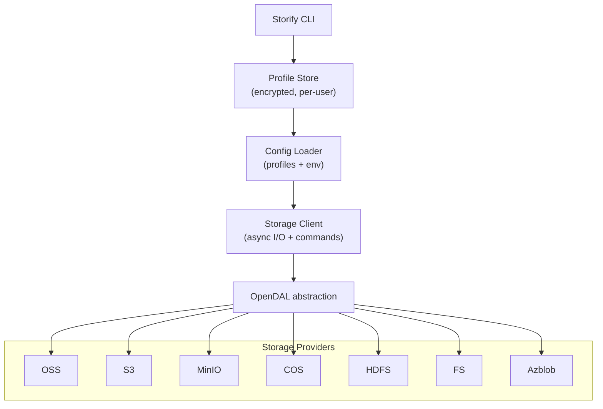

# Architecture and Development

Storify is built on [OpenDAL](https://github.com/apache/opendal) to provide a unified storage layer.

## Components
- Profile Store: encrypted, ownership-locked store for multiple profiles.
- Config Loader: merges profile values with environment variables (env overrides).
- Storage Client: executes HDFS-like commands with progress-aware async I/O.
- OpenDAL: provider abstraction covering OSS, S3, MinIO, COS, HDFS, FS, Azblob.

## Development
- Prerequisites: Rust 1.80+ (see `rust-toolchain.toml`), Cargo, Git.
- Build (debug): `cargo build`
- Build (release): `cargo build --release`
- Tests: `cargo test`
- Lints: `cargo clippy --all-targets --workspace -- -D warnings`
- Contributions: see `CONTRIBUTING.md`
